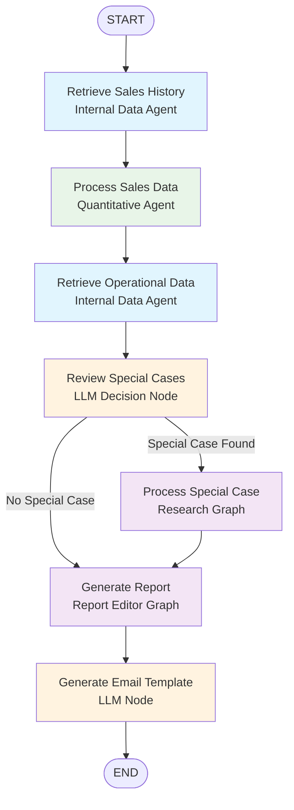
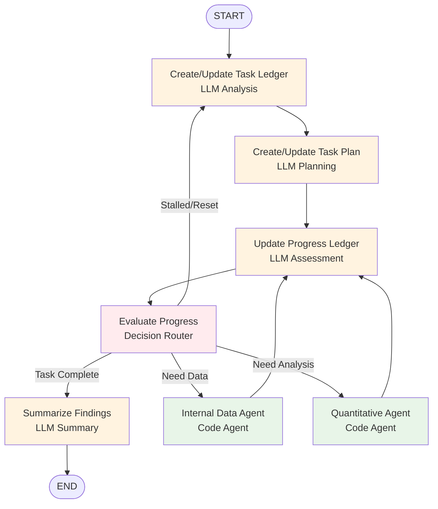
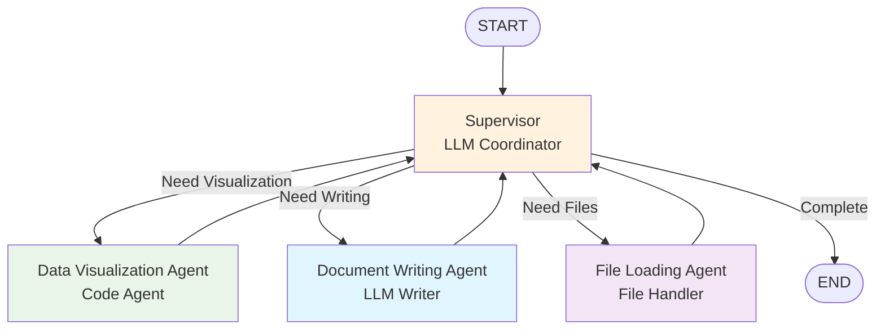
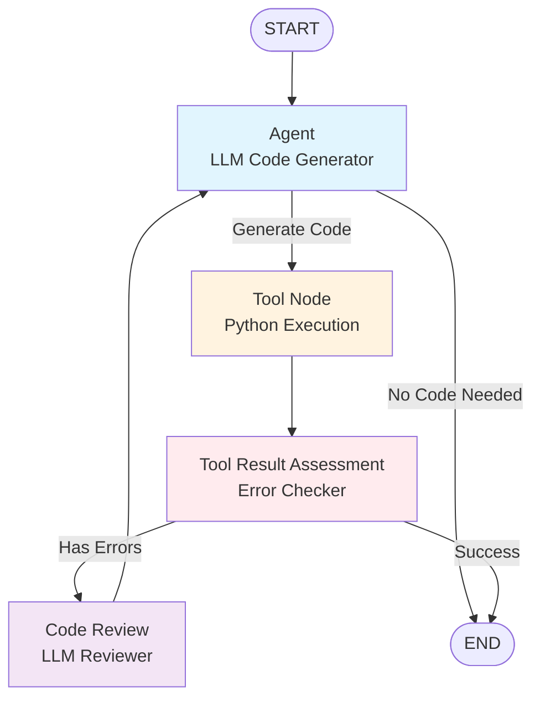

# Agent System Architecture

## Overview

The AI Analyst uses a multi-agent system built on LangGraph to process financial data and generate reports. The system is designed as a graph of interconnected agents, each with specific responsibilities.

## Core Agents

### 1. Report Graph (`report_graph.py`)
- **Purpose**: Main orchestrator that coordinates the entire report generation process
- **State**: `SalesReportGraphState`
- **Workflow**: Research → Analysis → Report Generation → Review

### 2. Research Graph (`research_graph.py`)  
- **Purpose**: Gathers and analyzes external market data and trends
- **State**: `ResearchGraphState`
- **Data Sources**: Web research, market analysis, competitor data

### 3. Internal Data Agent (`internal_data_agent.py`)
- **Purpose**: Processes company's internal financial data
- **Data Sources**: CSV files in `/data` folder, database queries
- **Outputs**: Formatted datasets for analysis

### 4. Quantitative Agent (`quant_agent.py`)
- **Purpose**: Performs statistical analysis and calculations
- **Functions**: Trend analysis, variance calculations, forecasting

### 5. Data Visualization Agent (`data_visualization_agent.py`)
- **Purpose**: Creates charts and graphs for reports
- **Output**: Matplotlib-generated visualizations

### 6. Report Editor Graph (`report_editor_graph.py`)
- **Purpose**: Reviews and refines generated reports
- **State**: `ReportEditorGraphState`
- **Functions**: Quality control, formatting, final review

### 7. Database Agent (`db_agent.py`)
- **Purpose**: Handles database queries and data retrieval
- **Database**: Azure SQL integration

## Report Graph Flow

The main orchestration happens through the Report Graph, which coordinates all agents and sub-graphs. Here's the complete workflow:

### Flow Breakdown

1. **Retrieve Sales History** - Uses Internal Data Agent to extract historical sales data
2. **Process Sales Data** - Quantitative Agent performs statistical analysis and trend calculations
3. **Retrieve Operational Data** - Internal Data Agent gathers additional operational metrics
4. **Review Special Cases** - LLM evaluates if anomalies require deeper investigation
5. **Process Special Case** (conditional) - Research Graph conducts in-depth analysis if needed
6. **Generate Report** - Report Editor Graph creates the final formatted report
7. **Generate Email Template** - LLM creates email content for report delivery

### Sub-Graph Interactions

When the Report Graph calls sub-graphs:

- **Research Graph**: Invoked for special case analysis, runs its own multi-step workflow
- **Report Editor Graph**: Handles final report formatting and quality control
- **Individual Agents**: Called directly for specific data processing tasks

## Research Graph Flow

The Research Graph is invoked when special cases are detected and require in-depth analysis:

### Research Graph Logic

1. **Create/Update Task Ledger** - LLM analyzes task requirements and context
2. **Create/Update Task Plan** - LLM creates execution strategy
3. **Update Progress Ledger** - LLM evaluates current progress and next steps
4. **Evaluate Progress** - Router decides next action based on progress assessment:
   - Route to Internal Data Agent if data retrieval needed
   - Route to Quantitative Agent if analysis needed
   - Route to Summarize if task complete
   - Reset to Task Ledger if stalled
5. **Agents execute and return to progress evaluation**
6. **Summarize Findings** - Final LLM summarization when complete

## Report Editor Graph Flow

The Report Editor Graph handles final report generation with multiple specialized agents:

### Report Editor Logic

1. **Supervisor** - LLM coordinator evaluates current report state and decides next action
2. **Conditional routing** to specialized agents:
   - **Data Visualization Agent**: Creates charts and graphs using matplotlib
   - **Document Writing Agent**: Handles report content and formatting
   - **File Loading Agent**: Manages file operations and data loading
3. **All agents return to Supervisor** for next decision
4. **Loop continues** until report is complete per supervisor assessment

## Code Agent with Review Pattern

Several agents use a shared "Code Agent with Review" workflow for safe code execution:

**Agents using this pattern:**
- Internal Data Agent
- Quantitative Agent  
- Data Visualization Agent

### Code Agent Logic

1. **Agent** - LLM generates Python code based on task requirements
2. **Tool Node** - Executes code in sandboxed Python environment
3. **Tool Result Assessment** - Checks for execution errors or issues
4. **Code Review** (if errors) - LLM reviews errors and provides feedback
5. **Loop back to Agent** for code refinement
6. **End** when successful execution achieved

This pattern ensures safe code execution with automatic error detection and iterative improvement.

## Tools and Utilities

### Prompt Management (`prompts/`)
- Jinja2 templates for consistent AI prompts
- Modular prompt components for reuse

### Output Utils (`utils/output_utils.py`)
- File management for reports
- PDF conversion utilities
- Storage and caching functions

### Email Service (`utils/email_service.py`)
- Automated report delivery
- SMTP integration

## Configuration

### Model Selection (`models.py`)
- Supports multiple AI providers (Gemini, Azure OpenAI, Azure Foundry)
- Dynamic model selection based on task requirements

### Settings (`configuration/settings.py`)
- Environment-based configuration
- Azure authentication integration
- Database connection management

## Error Handling and Retry Logic

- Configurable retry limits for failed agent executions
- Comprehensive logging for debugging
- Graceful fallback mechanisms