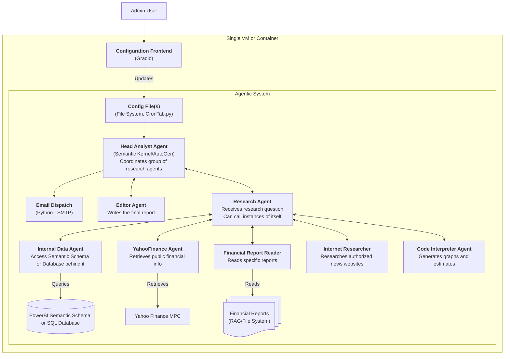

# AI Financial Analyst - High Level Plan

## Proposed Report Structure

The following is the report structure I have pictured so far. I personally prefer relatively simple structures, but please let me know if you would prefer to break it down further. My notes on the content assume we will be doing a single report, but the structure can also be used if the target is one report per KPI as well.

1. **Executive Summary**
    - Key findings
    - Current value of KPIs and comparison to last period
    - No charts or tables
2. **Overview**
    - Quick snapshot of the value of the KPIs for the current period
    - Comparison with the previous period
    - Comparison vs. target/benchmark if we have one
    - Key insights or highlights about performance
3. **Trends and Context**
    - Short-term trend chart or table (last 3–5 periods) for each KPI
    - High-level explanation of what drives changes in each KPI (e.g., volume, price, cost impact, broader market events)
    - Relevant operational metrics directly influencing the KPI
    - Highlight any negative trends, changes in trends, or outliers (”special cases”)
4. **In depth analysis**
    - For each KPI with a "special case" (this section could be excluded if there isn’t any):
        - An explanation of the main causes or business events impacting the KPI
        - Any relevant operational or financial events linked to the variance
5. **Forward Outlook and Recommendations**
    - Forecast or outlook for the KPI based on current data
    - For each KPI with special cases:
        - Suggested actions or focus areas to remedy / maintain
        - Forecast for the KPI if actions are implemented

## High Level Architecture

The following is the high level architecture I have imagined so far, including the stack decisions I have already made.

## Proposed Implementation Process

I propose an incremental plan for developing this system, so we can ensure we get to a working MVP first, even if it does not include all the potential functionalities, and add on to it as time allows after.

I have identified the [WideWorldImporters](https://github.com/Microsoft/sql-server-samples/blob/master/samples/databases/wide-world-importers/README.md) database as the source of dummy data for the MVP. It is a database created by Microsoft for their own educational content, and seems to have a default semantic schema to test the PowerBI agent if we do go that route. Please read the last section for my notes on PowerBI access.

1. Define core stack *(Mostly done)*:
    - Inference provider - *GitHub Models Marketplace (Can be easily changed to any other provider if API Keys provided)*
    - Agent framework - *Microsoft's Semantic Kernel*
    - Structure of data provision - *Azure DB*
    - Agent inputs - *KPIs configured by the user*
    - Sample data - *WideWorldImporters Sample Dataset*
2. Create basic configuration frontend *(Done)*:
   - Decide the stack - *I am using Gradio, a python library that renders a simple frontend*
   - Set up the system to run autonomously
   - Update the timing of autonomous runs
3. Create a basic agent system that can achieve the following process *(Done)*:
   1. Take a single KPI provided in configuration *(Done)*
   2. Take information from a PowerBI or Database, depending on API Keys *(Done)*
   3. Create a simplified report (Executive Summary, Overview and Recommendations) *(Done)*
   4. Self-review the report and ensure it has the required information *(Done - in theory)*
   5. Email to a set address *(Done)*
4. Add basic forecasting (CAGR or similar) to the report
5. Add “special case” detection
    1. Identify special cases (changes in trend, outliers, or negative trends)
    2. Define research plan with available tools, including exploring operational information if available
    3. Implement research plan
    4. Add sections to the report
6. Add "correction plans" for special cases
    - Include attempting to obtain historical correlation - check similar clients in the past (e.g., if a client's revenue is down 10%, how have similar clients behaved in the past)
7. Open to take more than a single KPI
    - Add an editor agent that can take all the individual reports and make a consolidated one
8. Prompt Engineering
9. **Up to here we will have the MVP; then we can continue adding additional sources of information, which I would suggest we add in the following order:**
    1. Add document retrieval (define if using RAG or another agent)
    2. Add access to Yahoo Finance
    3. Add internet access to the internet in general, defining a list of approved sites
    4. Potentially: Add flexibility of Database type
    5. Potentially: Add more advanced forecasting

### Agent Development Process

When development each agent, I would like to approach in line with "Evaluation Driven Design" (similar to TDD); in summary:

1. Define the expected behaviour
2. Define a set of scenarios to evaluate
3. Define the dataset available for those scenarios
   - We can consider creating custom datasets that match important scenarios if the data is not available, but this could add a lot of time to the process
4. Define the type of evaluation (e.g., LLM as judge, a defined set of rules, or just manual revision) for each scenario
5. Write evaluation code
6. Write the actual agent / new behaviour

This would make the development process a bit slower and maybe require a bit more data, but I believe give confidence to experiment with different prompts / models.

## Questions / Asks for A&M Team

- Report Structure:
  - Are we writing a single report for a set of KPIs, or a report per KPI? - *I will work under the assumption of a single report unless advised differently*
  - Are the KPIs a given (and thus can they be included in the prompt) or should they be configured by the user? - *I will work under the assumption that the user needs to be able to set this up from the configuration frontend*
- Technology Stack:
  - Do you have preferred inference provider (e.g., OpenAI or Azure)? - *I will work with GitHub Model Marketplace as it provides free access to a few models*
    - KEY NOTE: I believe the best alternative if we want to access a PowerBI Semantic Model is to use Azure's Data Agent.
  - Do you have a preferred Agent Framework to use in this project (e.g., LangGraph or OpenAI's SDK)?
  - Low priority for now but can help define which stack to use for the frontend:
    - Are there any specific needs for authentication (e.g., a specific OIDC provider)?
    - Does the frontend need to be accessible as a public website?
- PowerBI:
  - I understood we will be using a defined schema you have already designed, if so, can you please share?
  - Do you have a preferred way of connecting to the PowerBI?
    - To clarify what I mean, I could create a .pbi file in the same folder as the agent, but I imagine the preference would be to provide a URL, but then we might need to deal with Microsoft Authentication.
  - Ideally, at least one sample PowerBI file.
- Database:
  - When you refer to a Database, I am not 100% sure if that is the same Database the PowerBI file takes their information from, or if its a different Database.
    - If it's a different Database, do you have a set schema? And a Database type (Postgres, MySQL, etc.)
- Financial Reports
  - How would the financial reports be provided (e.g., URL, as files to be uploaded to the agent, etc.)

## PowerBI Notes

From my research, I find that if we want an agent that can access a PowerBI Semantic Model, we would need two things during development:

1. Access to a way to share the Semantic Model.
   - There seems to be two or three options but all require a subscription (such as Microsoft Fabric or Azure Active Directory).
2. A way to consume the Semantic Model; the options seem to be:
   - Use a Microsoft Fabric Data Agent: probably the best option in terms of quality; works with a Semantic Schema that can be accessed in Fabric.
   - Use a community module for LangChain: seems to be experimental and not maintained, so likely not a good option; works with a PowerBI Rest (Azure Active Directory).
   - Create our own connection: interesting to do, but we don't know how long it will take or how successful it would be; we can decide how to provide the Semantic Schema.

With this in mind, I would prefer to use a Fabric Data Agent to extract information from the PowerBI and provide it to our own AI Analyst as a tool; that said, I am open to any approach, but for all of them I would need your support to get access to a Microsoft account with the appropriate permissions; otherwise, I will have to work with the agent directly querying the Database that feeds the Schema, but we then loose the power of the Semantic Schema; this right now is the biggest blocker to start working on the MVP.
